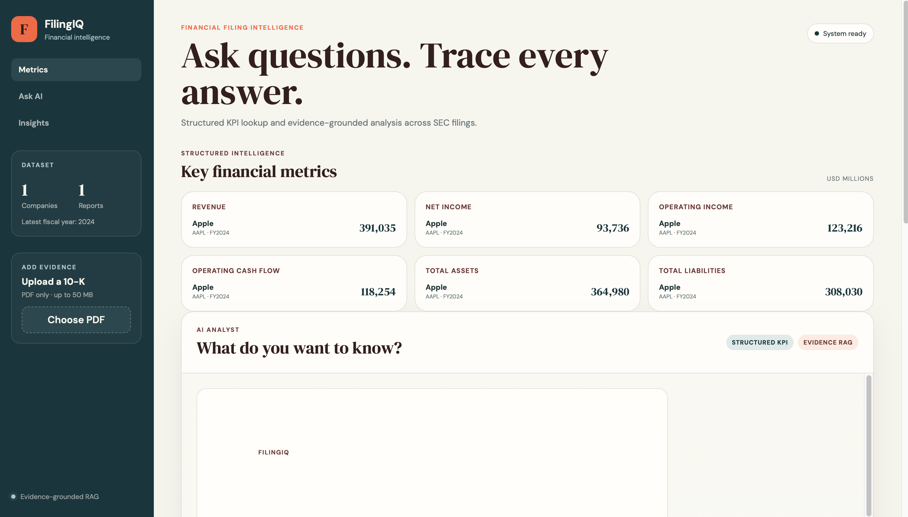
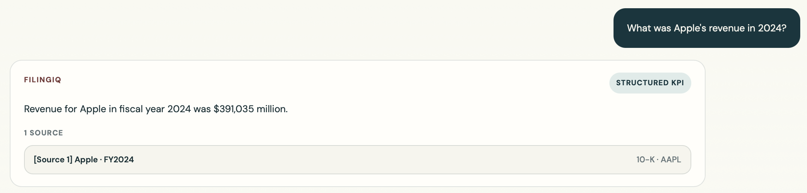
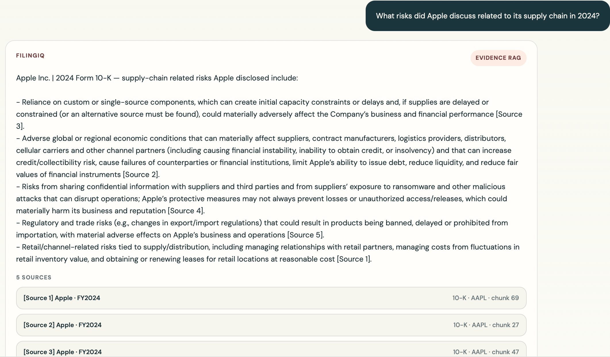
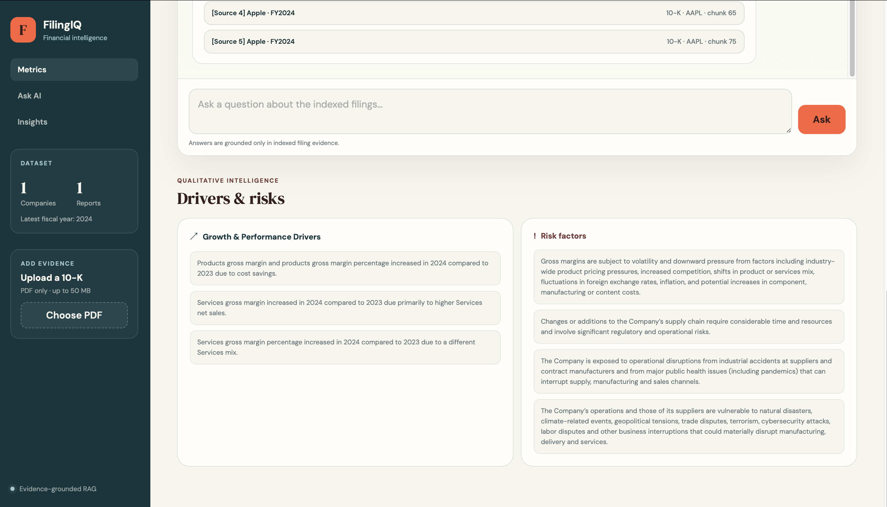

# FilingIQ — Financial Filing Intelligence

FilingIQ is a financial filing analysis application for annual reports and 10-Ks.

It combines deterministic PostgreSQL lookup for exact financial KPIs with evidence-grounded RAG for qualitative, explanatory, and comparative questions.

The system uses FastAPI, Azure OpenAI, Azure AI Search, PostgreSQL, PyMuPDF4LLM, and a lightweight HTML/CSS/JavaScript frontend.

---

## Features

* PDF filing ingestion
* PDF-to-Markdown conversion with PyMuPDF4LLM
* Markdown-aware recursive chunking
* Azure OpenAI embeddings
* Dense vector retrieval with Azure AI Search
* Query-aware company/year retrieval
* Balanced retrieval for multi-company questions
* Source citations and provenance
* Abstention when evidence is insufficient
* PostgreSQL lookup for exact KPIs
* KPI extraction from financial statements
* Growth/performance driver extraction
* Risk-factor extraction
* FastAPI backend
* Financial dashboard
* Upload validation
* Structured logging
* Docker packaging
* GitHub Actions CI
* Automated tests

---

## Architecture

```text
                     User Question
                          |
                          v
                  Deterministic Router
                   /                \
                  /                  \
         Exact supported KPI     Qualitative / comparison
                |                         |
                v                         v
           PostgreSQL              Company/year detection
                                          |
                                          v
                                Query-aware Dense retrieval
                                          |
                                          v
                                Balanced evidence merge
                                          |
                                          v
                               Provenance-rich Top-5 context
                                          |
                                          v
                                     Azure OpenAI
                                          |
                                          v
                                Answer + citations
```

The two query paths are intentional.

Exact metrics such as revenue or net income are retrieved from PostgreSQL when structured data is available. Questions that require explanation or synthesis use RAG.

Supported structured metrics:

```text
revenue
net_income
operating_income
operating_cash_flow
total_assets
total_liabilities
```

---

## Ingestion Pipeline

```text
PDF
 |
 v
File validation
 |
 v
Metadata / document identity
 |
 v
PyMuPDF4LLM
 |
 v
Markdown
 |
 v
Recursive markdown-aware chunking
 |
 v
Azure OpenAI embeddings
 |
 v
Azure AI Search
 |
 v
KPI extraction
 |
 v
PostgreSQL
```

The final chunker uses:

```python
RecursiveCharacterTextSplitter(
    chunk_size=1500,
    chunk_overlap=200,
    separators=[
        "\n## ",
        "\n### ",
        "\n\n",
        "\n",
        ". ",
        " ",
        "",
    ],
)
```

---

## Retrieval

The original project stored embeddings but the query path was effectively lexical.

Dense retrieval was added and evaluated against BM25 and Azure hybrid retrieval.

### Retrieval benchmark

44 answerable questions were used for retrieval evaluation.

| Metric              |        BM25 |      Dense |     Hybrid |
| ------------------- | ----------: | ---------: | ---------: |
| Recall@1            |      0.1364 |     0.2386 | **0.2727** |
| Recall@5            |      0.3030 | **0.4886** |     0.4659 |
| Recall@10           |      0.3485 | **0.5795** | **0.5795** |
| Complete Evidence@5 |      0.2727 | **0.4318** |     0.3864 |
| MRR                 |      0.2137 | **0.4304** |     0.4124 |
| Median latency      | **64.4 ms** |   210.3 ms |   322.7 ms |

Dense retrieval was retained because it provided a better overall balance of evidence coverage, ranking quality, and latency than hybrid search.

---

## Query-Aware Retrieval

Some comparison questions retrieved too much evidence from one company.

The query-aware retriever detects company/year targets, retrieves per target, and combines the results with a balanced merge.

Targeted weak-case evaluation:

```text
7 questions tested
3 improved
4 unchanged
0 regressed
```

This strategy is used for the final RAG path.

---

## KPI Extraction

KPI extraction is performed with focused retrieval rather than one large mixed context.

Separate contexts are used for:

### Income statement

* revenue
* operating income
* net income

### Balance sheet

* total assets
* total liabilities

### Cash flow statement

* operating cash flow

The extractor only returns values supported by retrieved evidence. Missing totals are left null rather than calculated or inferred.

### KPI benchmark

```text
30 expected KPI values
29 correct
0 incorrect
1 missing
96.67% accuracy
```

| KPI                 | Correct |
| ------------------- | ------: |
| Revenue             |     5/5 |
| Net income          |     5/5 |
| Operating income    |     5/5 |
| Operating cash flow |     5/5 |
| Total assets        |     5/5 |
| Total liabilities   |     4/5 |

The one missing value was Amazon total liabilities because the exact consolidated total was not present in the retrieved evidence.

---

## Answer Evaluation

The final answer benchmark contained:

```text
50 total questions
44 answerable
6 unanswerable
```

Results for the 44 answerable questions:

```text
41/44 at least partially correct — 93.2%
32/44 fully correct — 72.7%
```

Average LLM-judge scores:

| Metric           |      Score |
| ---------------- | ---------: |
| Correctness      | 1.6591 / 2 |
| Groundedness     |    2.0 / 2 |
| Citation support |    2.0 / 2 |
| Abstention       |    2.0 / 2 |

These are rubric-based LLM-judge scores, not general accuracy guarantees.

The main remaining weakness is incomplete evidence coverage on broad questions that require several complementary pieces of evidence.

---

## Context Size Experiment

Top-5 and Top-10 generation context were compared on 18 questions.

| Metric                  |      Top-5 |     Top-10 |
| ----------------------- | ---------: | ---------: |
| Avg. context characters |    6,045.5 |   12,539.6 |
| Avg. prompt tokens      |    1,752.3 |    3,485.4 |
| Avg. generation latency | 7,724.2 ms | 8,268.6 ms |
| Avg. total latency      | 8,267.5 ms | 8,631.5 ms |

Top-10 nearly doubled context size without enough quality improvement to justify the added cost and noise.

The final generation context remains Top-5.

---

## Chunking Experiment

Recursive Markdown-aware chunking was compared with a structure-aware alternative on a controlled Apple 2024 subset.

| Metric    |  Recursive | Structural v2 |
| --------- | ---------: | ------------: |
| Recall@1  | **0.3462** |        0.2692 |
| Recall@5  | **0.6923** |        0.6538 |
| Recall@10 | **0.9231** |    **0.9231** |
| MRR       | **0.5417** |        0.4896 |

The structural variant did not improve retrieval enough to replace the simpler recursive chunker.

---

## Reranker Experiment

A BGE reranker was tested using:

```text
Query-aware Dense Top-20
        |
        v
BAAI/bge-reranker-base
        |
        v
Top-5
```

Result:

```text
4 questions tested
0 improved
4 unchanged
0 regressed
```

It also added roughly 0.87–1.18 seconds of latency on the tested requests.

Reranking was not retained.

---

## Qualitative Insights

The dashboard also stores and displays:

### Growth & Performance Drivers

Examples include:

* margin changes
* demand drivers
* product/service performance
* revenue drivers

### Risk Factors

Examples include:

* supply-chain dependencies
* cybersecurity risks
* competitive pressures
* regulatory exposure
* third-party manufacturing risk

Qualitative fields are updated separately from numerical KPI fields so they cannot overwrite existing financial metrics.

---

## PostgreSQL

The main structured table stores filing-level provenance and metrics.

Core fields:

```text
document_id
company
ticker
fiscal_year
filing_type

revenue
net_income
operating_income
operating_cash_flow
total_assets
total_liabilities

risk_factors
growth_drivers

created_at
updated_at
```

Unique filing constraint:

```text
(ticker, fiscal_year, filing_type)
```

Writes use an UPSERT to keep repeated ingestion idempotent.

Financial values are stored in USD millions.

---

## Testing

Current test suite:

```text
21 collected
21 passed
0 failed
```

Tests cover:

* request validation
* year validation
* PDF upload validation
* empty-file handling
* structured KPI routing
* qualitative RAG routing
* unsupported metrics
* company alias detection
* year detection
* multi-company targeting
* multi-year targeting
* balanced evidence merge
* structured answer formatting

Run:

```bash
pytest tests/ -v
```

---

## Observability

Structured logs include:

* request ID
* selected route
* structured lookup/fallback
* retrieval targets
* retrieval latency
* generation latency
* total latency
* source count
* request status
* errors
* abstention behavior

---

## Input Validation

Implemented safeguards include:

* Pydantic request validation
* empty-question rejection
* question length limits
* fiscal-year bounds
* PDF extension validation
* MIME validation
* 50 MB upload limit
* safe filenames
* streaming uploads
* empty-file rejection
* temporary-file cleanup
* generic user-facing internal errors
* environment-based credentials

---

## Tech Stack

### AI / Retrieval

* Azure OpenAI
* Azure AI Search
* PyMuPDF4LLM
* LangChain text splitters

### Backend

* Python 3.12
* FastAPI
* Pydantic
* PostgreSQL

### Frontend

* Jinja2
* HTML
* CSS
* JavaScript

### Engineering

* Docker
* Pytest
* GitHub Actions

---

## Local Setup

Clone the repository:

```bash
git clone https://github.com/chaysai2204/Financial-intelligence-rag.git
cd Financial-intelligence-rag
```

Create a virtual environment:

```bash
python -m venv .venv
source .venv/bin/activate
```

Install dependencies:

```bash
pip install -r requirements.txt
```

Create a `.env` file containing the required Azure OpenAI, Azure AI Search, and PostgreSQL configuration.

Run the application:

```bash
uvicorn app:app --reload
```

Open:

```text
http://127.0.0.1:8000
```

---

## Docker

Build:

```bash
docker build -t filingiq .
```

Run:

```bash
docker run \
  --env-file .env.docker \
  -p 8000:8000 \
  filingiq
```

Open:

```text
http://localhost:8000
```

---

## Continuous Integration

GitHub Actions runs:

```text
Install dependencies
        |
        v
Run pytest
        |
        v
Build Docker image
```

The repository uses CI only. There is no active deployment pipeline.

---

## Evaluation Artifacts

Detailed experiment results are stored under:

```text
evaluation/
```

Important files include:

```text
retrieval_summary.json
retrieval_results.json
retrieval_baseline_report.md
hybrid_retrieval_report.md

chunking_experiment_results.json
chunking_experiment_report.md

context_k_experiment_results.json

kpi_ground_truth.json
kpi_extraction_results.json

answer_evaluation_results.json

query_aware_v2_results.json

reranker_answer_results.json

RETRIEVAL_DECISIONS.md
```

The original Azure Search corpus was later modified during quota cleanup, so these saved artifacts are the reference for the reported benchmark results.

---

## Limitations

* Small curated filing corpus
* No permanent public deployment
* No authentication or user-level isolation
* No full load/concurrency testing
* Qualitative extraction has less evaluation coverage than KPI extraction
* Broad questions requiring several independent pieces of evidence can still be incomplete
* Historical Azure AI Search infrastructure reached storage quota during later demo preparation

---

## Screenshots

### Dashboard



### Structured KPI Query



### Evidence-Grounded RAG



### Growth & Performance Drivers / Risk Factors



---


## Repository

https://github.com/chaysai2204/Financial-intelligence-rag
